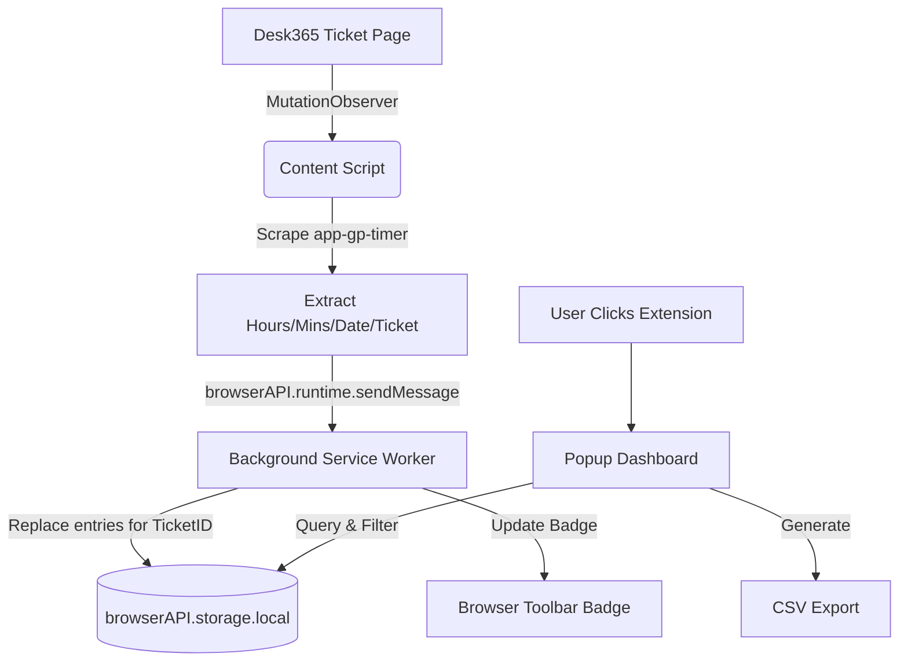

# Architecture: Desk365 Time Keeper

## Overview
A Chrome extension designed to track billable time entries submitted via the Desk365 "Add Time Entry" dialog. It aggregates totals locally and provides a dashboard for daily, weekly, and monthly views.

## Core Components

### 1. Content Script
- **Responsibility**: Monitors the DOM for the Desk365 ticket page and time entries.
- **Detection Logic**:
    - Uses `MutationObserver` to detect page changes and the presence of time entries.
    - **Primary Sync**: Scrapes the list of existing time entries (`app-gp-timer` elements) to ensure the local database matches the ticket's state.
    - **Secondary Sync**: Listens for the "Save" button in the `app-te-dialog` to trigger a re-sync after a new entry is added.
    - Extracts:
        - Hours and Minutes from the timer display.
        - Date from the entry metadata (e.g., "on MM/DD/YY").
        - Ticket ID from the breadcrumb (`.breadcrumb-active`).
        - Organization/Company from the contact info (`.contact-info-container-old`).
- **Communication**: Sends `SYNC_TIME_ENTRIES` messages to the Background Service Worker.

### 2. Background Service Worker
- **Responsibility**: Acts as the central data controller and manages the extension badge.
- **Cross-Browser Support**: Uses `browserAPI` abstraction to support both Chrome (`chrome.*`) and Firefox (`browser.*`).
- **Data Management**:
    - Receives `SYNC_TIME_ENTRIES` and `SAVE_TIME_ENTRY` messages.
    - Manages `browserAPI.storage.local` with a promise-based queue to prevent race conditions.
    - **Sync Logic**: When syncing a ticket, it replaces all existing local entries for that specific `ticketId` with the fresh data from the page.
- **Badge Management**:
    - Calculates the total for "Today" and updates the extension badge text (e.g., "2.5h").
    - Updates badge color based on time tracked:
        - Green: < 45m
        - Yellow: 45m - 1h
        - Red: > 1h
- **Persistence**: Handles all read/write operations to local storage.

### 3. Popup Dashboard
- **Responsibility**: Provides the user interface for viewing, filtering, and exporting data.
- **Features**:
    - **Time Navigation**: Allows jumping between days, weeks, and months.
    - **Aggregated Totals**: Displays totals for the selected Day, Week, and Month.
    - **Grouped View**: Displays entries grouped by **Organization** (Operator) and then by **Ticket**.
    - **User Filtering**: Optional filtering by "User Name" (configured in settings) to only show the current user's entries.
    - **Management**: Delete individual entries or clear all data.
    - **CSV Export**: Generates a CSV file including Date, Ticket ID, Organization, Hours, Minutes, and Billable status.
- **Tech**: Vanilla HTML/CSS/JS.

## Data Schema (browserAPI.storage.local)

```json
{
  "time_entries": [
    {
      "id": "uuid",
      "ticketId": "12345",
      "date": "YYYY-MM-DD",
      "hours": 1,
      "minutes": 30,
      "billable": true,
      "organization": "Company Name",
      "userName": "John Doe",
      "timestamp": 1677744000000
    }
  ],
  "user_name": "John Doe"
}
```

## System Workflow



## Export Format (CSV)
`Date, Ticket ID, Organization, Hours, Minutes, Total Decimal, Billable`

## Constraints & Security
- **No External Hosting**: All data stays in `browserAPI.storage.local`.
- **Privacy**: Only interacts with Desk365 domains specified in `manifest.json`.
- **Reliability**: Uses a sync-based approach rather than just intercepting clicks to ensure data consistency even if entries are added/removed outside the extension's view.
